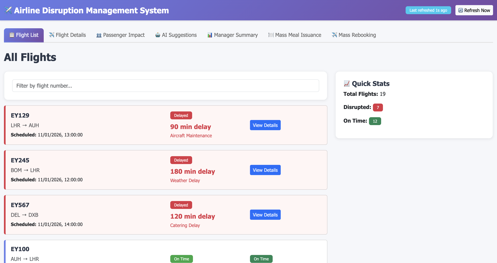
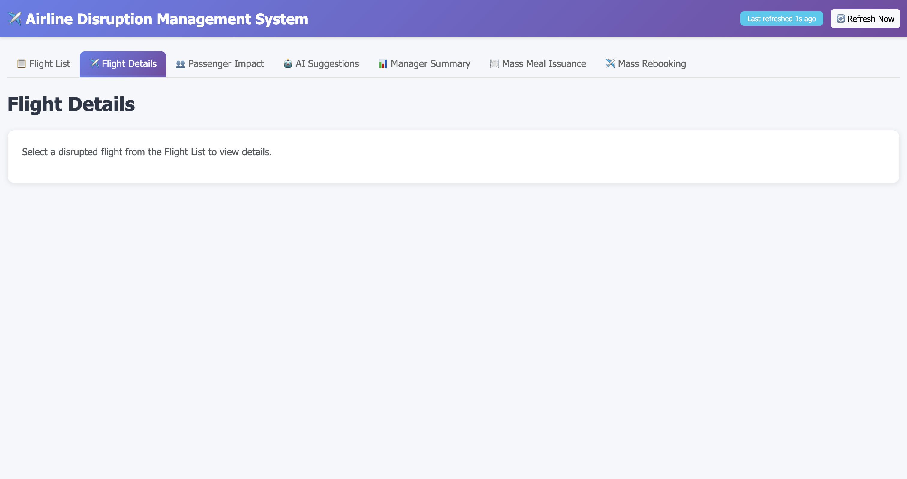
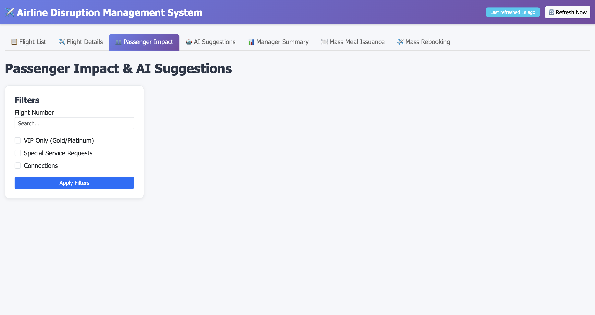
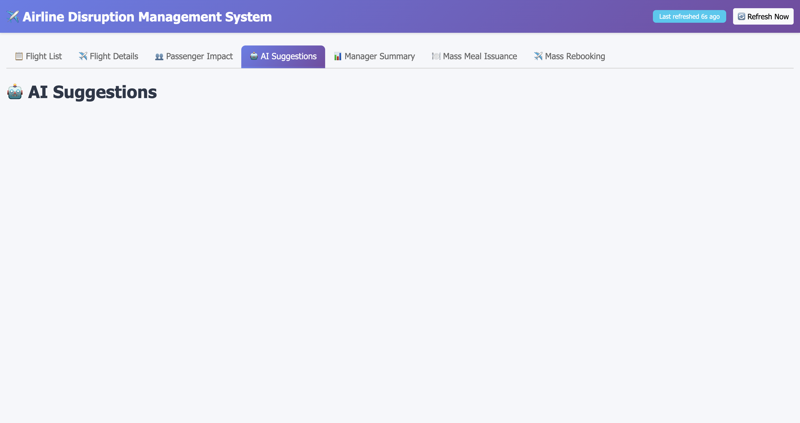
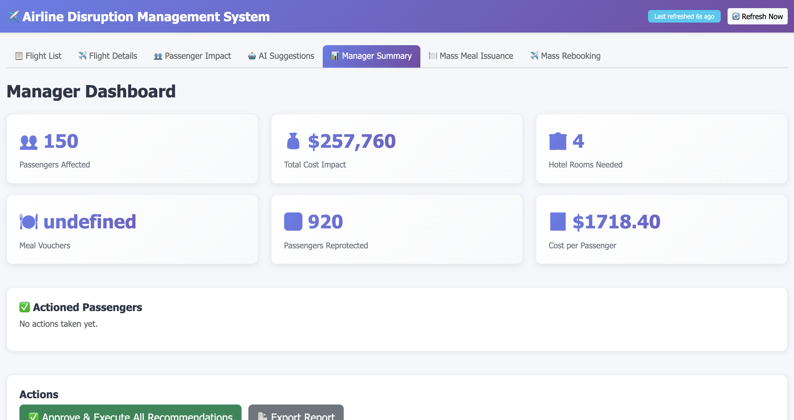
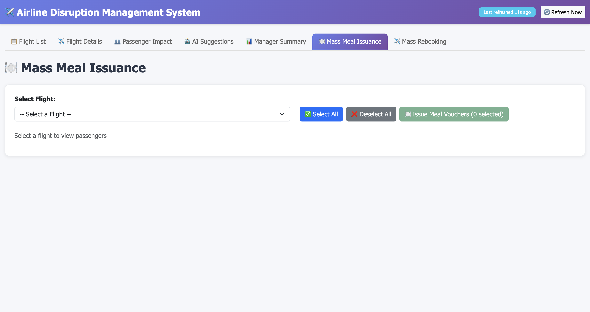
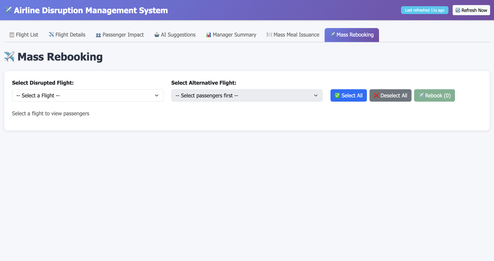

# 📸 UI Screenshots and Documentation

## Overview

This document contains visual documentation for all tabs in the Airline Disruption Management System web UI. Each tab includes a screenshot and detailed description of features and functionality.

---

## 1. 📋 Flight List Tab



### Description
The Flight List tab is the main dashboard that displays all flights in the system with their current status. This is the first tab users see when they open the application.

### Features
- **Flight Overview**: Lists all flights with key information
- **Status Indicators**: Color-coded status badges
  - 🟢 Green: On-time flights
  - 🔴 Red: Delayed/Disrupted flights
- **Quick Stats**: 
  - Total flights count
  - Disrupted flights count
  - Total affected passengers
  - Total estimated cost impact
- **Action Buttons**: 
  - View Details button for each flight
  - Drill down to specific flight information

### Use Case
Flight managers use this tab to quickly assess the current disruption situation and identify which flights need attention.

---

## 2. ✈️ Flight Details Tab



### Description
The Flight Details tab provides comprehensive information about a selected flight, including passenger manifest, disruption timeline, and the system's recommendations.

### Features
- **Flight Information Panel**:
  - Flight number and designation
  - Original departure/arrival times
  - Current status
  - Aircraft information
- **Passenger Manifest**:
  - Complete list of all passengers
  - Passenger status (affected/not affected)
  - Compensation eligibility
  - Booking class
- **Disruption Details**:
  - Reason for disruption
  - Estimated recovery time
  - Historical timeline
- **Recommendations Panel**:
  - AI-generated passenger care suggestions
  - Hotel accommodation needs
  - Meal voucher recommendations
  - Rebooking options

### Use Case
Operations teams use this tab to understand the full impact of a disruption and see automated recommendations for passenger care.

---

## 3. 👥 Passenger Impact Tab



### Description
The Passenger Impact tab provides a comprehensive view of all passengers affected by any disruption, with their individual impact assessment and care status.

### Features
- **Passenger List**:
  - All passengers affected by disruptions
  - Passenger ID and booking reference
  - Original flight and status
  - Compensation eligibility tier
- **Impact Assessment**:
  - Disruption duration
  - Eligible care (hotel, meals, etc.)
  - Compensation amount due
  - Passenger priority level
- **Search and Filter**:
  - Filter by flight number
  - Filter by status
  - Filter by compensation tier
  - Search by passenger name/ID
- **Individual Actions**:
  - View/Apply individual passenger recommendations
  - Process individual rebooking
  - Issue individual meal coupons
  - View action history
- **Bulk Actions**:
  - Select multiple passengers with checkboxes
  - Apply mass meal issuance
  - Apply mass rebooking

### Use Case
Customer service teams use this tab to:
- Identify which passengers need care
- Apply appropriate compensation and care
- Track passenger satisfaction
- Process rebooking and meal vouchers

---

## 4. 🤖 AI Suggestions Tab



### Description
The AI Suggestions tab displays intelligent, LLM-powered recommendations for managing passenger disruptions. Powered by Ollama, it provides context-aware suggestions.

### Features
- **Recommendation Engine**:
  - Triggered by disruption detection
  - Uses Ollama LLM for intelligent analysis
  - Considers passenger type, booking class, disruption duration
- **Recommendation Types**:
  - **Hotel Accommodations**:
    - Specific hotel recommendations
    - Proximity to airport
    - Star rating and amenities
    - Estimated cost per night
  - **Meal Vouchers**:
    - Meal type and quantity
    - Voucher denomination
    - Redemption location
    - Validity period
  - **Rebooking Options**:
    - Alternative flight numbers
    - Departure times
    - Load status
    - Code-share information
- **Cost Analysis**:
  - Per-passenger care cost
  - Total cost projection
  - Compensation amount
  - Net cost impact
- **Automatic Application**:
  - Apply all recommendations with one click
  - Individual recommendation selection
  - Manual override options

### Use Case
Managers use this tab to:
- Review AI-generated passenger care plans
- Approve mass care operations
- Understand cost implications
- Ensure optimal passenger satisfaction

---

## 5. 📊 Manager Summary Tab



### Description
The Manager Summary tab provides an executive dashboard with key performance indicators (KPIs) and metrics for the entire disruption management operation.

### Metrics Displayed
- **Total Passengers Affected**: Count of all disrupted passengers
- **Total Cost Impact**: Estimated total cost of all care measures (in currency)
- **Hotel Rooms Needed**: Estimated hotel accommodations required
- **Meal Vouchers Issued**: Count of actual meal coupons distributed
- **Passengers Reprotected**: Count of passengers successfully rebooked
- **Average Cost Per Passenger**: Total cost ÷ affected passengers
- **Service Metrics**:
  - Processing status
  - Completion percentage
  - Time to resolution

### Features
- **Real-time Updates**: Automatically updated when actions are taken
- **Mass Action Tracking**: 
  - Tracks actual meal coupons issued via mass meal issuance
  - Tracks actual passengers rebooked via mass rebooking
  - Distinguishes between planned and executed actions
- **Cost Breakdown**: 
  - Hotel costs
  - Meal costs
  - Compensation amounts
  - Service charges
- **Performance Indicators**:
  - Passenger satisfaction metrics
  - Service level agreements (SLAs)
  - Response time analytics
  - Resolution rate

### Use Case
Executive managers and operation directors use this tab to:
- Monitor overall disruption impact
- Track cost of disruption management
- Ensure SLA compliance
- Report to stakeholders
- Make strategic decisions

---

## 6. 🍽️ Mass Meal Issuance Tab



### Description
The Mass Meal Issuance tab enables bulk distribution of meal coupons to multiple passengers at once, streamlining passenger care operations.

### Features
- **Passenger Selection**:
  - Checkbox selection for multiple passengers
  - "Select All" option
  - Quick filter to show eligible passengers
  - Batch operation display
- **Meal Coupon Configuration**:
  - Coupon denomination selector (e.g., $10, $20, $50)
  - Quantity per passenger selector
  - Total value calculation
  - Validity period setting
- **Bulk Issuance**:
  - Apply coupons to all selected passengers
  - Real-time processing indicator
  - Success/failure notifications
  - Issued coupon list preview
- **Tracking**:
  - Issue tracking number
  - Issue date and time
  - Issued by user ID
  - Status tracking
- **KPI Update**:
  - Automatically updates Manager Summary metrics
  - Tracks actual issued vouchers
  - Updates cost calculations

### Use Case
Operations teams use this tab to:
- Quickly issue meal compensation to affected passengers
- Batch process large disruption events
- Track coupon distribution
- Manage passenger morale during disruptions

---

## 7. ✈️ Mass Rebooking Tab



### Description
The Mass Rebooking tab enables bulk rebooking of multiple passengers to alternative flights, solving one of the most critical customer needs during disruptions.

### Features
- **Passenger Selection**:
  - Checkbox selection for multiple passengers
  - "Select All" option
  - Filter by original flight
  - Batch operation count display
- **Flight Selection**:
  - Available flights selector
  - Real-time seat availability
  - Departure and arrival times
  - Aircraft type and amenities
  - Code-share flight options
- **Rebooking Details**:
  - Original flight information
  - New flight assignment
  - Rebooking type (mass/individual)
  - Seat assignment
- **Bulk Processing**:
  - Apply rebooking to all selected passengers
  - Real-time processing
  - Success confirmations
  - Failed booking notifications
- **Confirmation**:
  - Passenger confirmation details
  - Rebooking reference numbers
  - New boarding pass info
  - Travel document updates
- **Tracking**:
  - Rebooking ID
  - Processing status
  - Completion timestamp
  - Processed by operator
- **KPI Update**:
  - Automatically updates Manager Summary
  - Tracks passengers reprotected
  - Updates satisfaction metrics
  - Reflects cost impact

### Use Case
Rebooking agents use this tab to:
- Process large groups of passengers for alternative flights
- Manage seat inventory across flights
- Ensure compliance with rebooking regulations
- Maintain detailed rebooking audit trail
- Improve customer satisfaction metrics

---

## Feature Integration Summary

### Data Flow
```
Disruption Detected
    ↓
Flight Details Retrieved
    ↓
Passengers Identified
    ↓
AI Recommendations Generated (Ollama LLM)
    ↓
Manager Reviews Summary
    ↓
Mass Actions Applied
    ├── Mass Meal Issuance
    └── Mass Rebooking
    ↓
KPIs Updated in Real-time
    ↓
Passenger Care Complete
```

### Tab Interaction Pattern
- **Flight List** → Identify disruptions
- **Flight Details** → Understand impact
- **Passenger Impact** → Assess individual needs
- **AI Suggestions** → Get recommendations
- **Mass Meal/Rebooking** → Apply solutions
- **Manager Summary** → Track outcomes

---

## System Architecture Integration

### Key Components
1. **Flask Backend**: API endpoints for all operations
2. **Ollama LLM Integration**: AI-powered recommendations
3. **JSON Data Persistence**: Flight, passenger, and action data
4. **Real-time Updates**: Dynamic UI updates
5. **Eligibility Engine**: Compensation and care determination

### API Endpoints
- `GET /api/flights` - Retrieve all flights
- `GET /api/flights/<id>/passengers` - Passenger list
- `GET /api/disruptions` - All disruptions
- `GET /api/manager-summary` - KPI dashboard
- `POST /api/actions/mass-meal-coupons` - Issue meal coupons
- `POST /api/actions/mass-rebookings` - Process rebookings

---

## Best Practices

### For Operations Managers
1. Check **Flight List** first to assess situation
2. Review **Manager Summary** for cost implications
3. Check **Flight Details** for passenger distribution
4. Use **AI Suggestions** to validate action plans
5. Execute using **Mass Meal/Rebooking** tabs
6. Monitor **Manager Summary** for updates

### For Customer Service
1. Use **Passenger Impact** to find affected customers
2. Explain options from **AI Suggestions**
3. Use **Mass Rebooking** for group bookings
4. Track confirmations in each tab
5. Refer to **Manager Summary** for SLA status

---

## Version History
- **v1.0** - Initial UI with 7 core tabs
- **Ollama LLM Integration** - AI-powered recommendations
- **Mass Action Endpoints** - Bulk meal and rebooking operations
- **Real-time KPI Tracking** - Manager Summary automatic updates
- **100+ Eligibility Rules** - Comprehensive compensation logic

---

## Support & Documentation
- See `README.md` for system overview
- See `INSTALLATION.md` for setup instructions
- See `API_REFERENCE.md` for all endpoints
- See `CONTRIBUTING.md` for development guidelines

